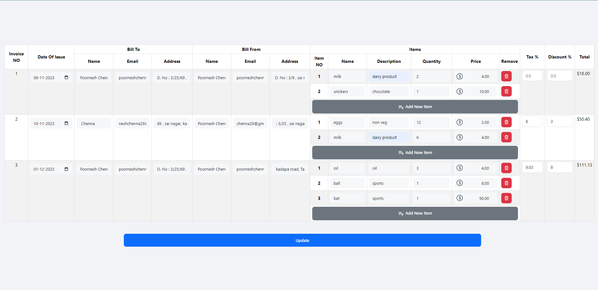
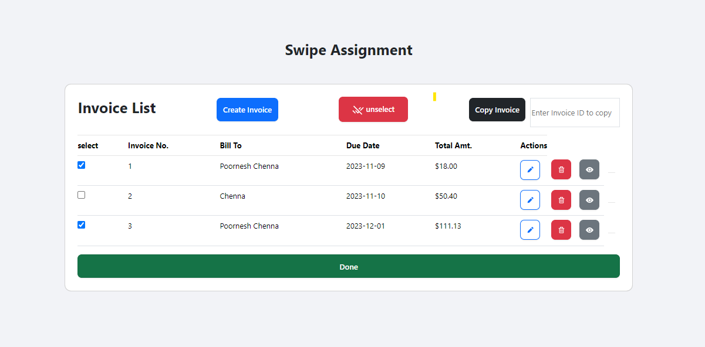

# swipe-assignment

## Bulk Edit Feature
The Invoice Bulk Edit feature allows users to efficiently manage and modify multiple invoices simultaneously in a spreadsheet-like format. This feature is designed to streamline the editing process, providing users with a convenient way to make changes to multiple invoices at once.

## Features

- **Multi-Selection**: Users can select multiple invoices using checkboxes.

- **Spreadsheet-Like Editing**: The Bulk Edit mode provides an interface similar to a spreadsheet, making it familiar and easy to use.

- **Redux store Update**: Changes made to the invoice data are reflected in the redux store, allowing users to see the impact of their edits in the invoice list screen.

## Screenshots




## Installation 
```
clone the repository
git clone https://github.com/poornesh-chenna/swipe-assignment.git

install dependencies
npm install

To run the project
npm start
```
